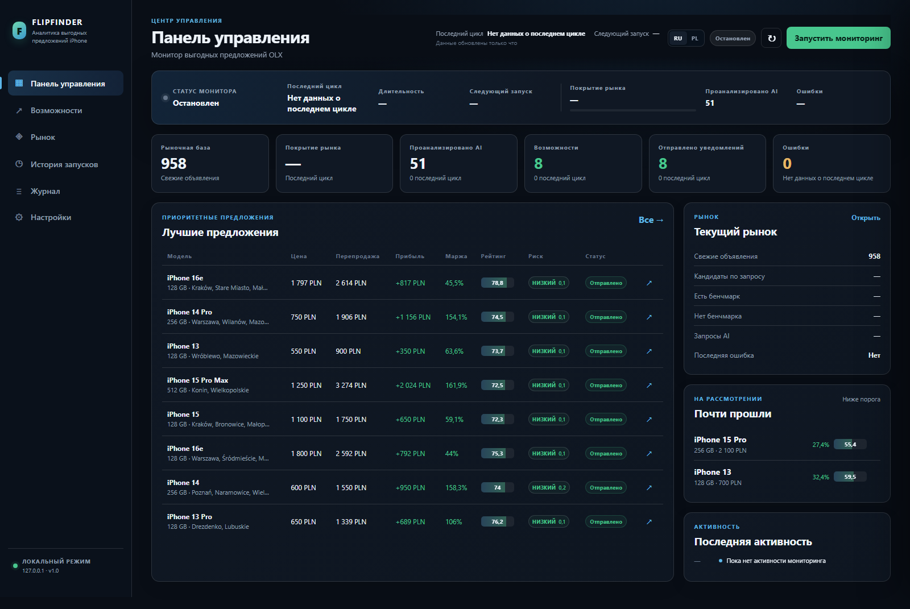
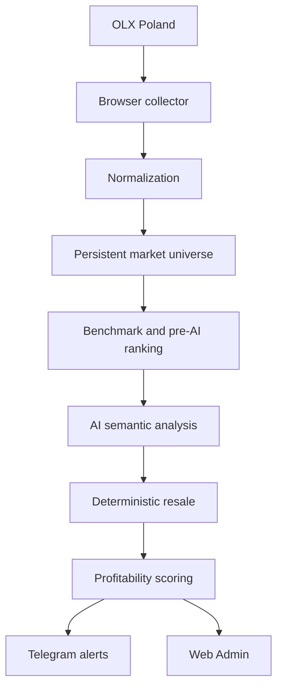
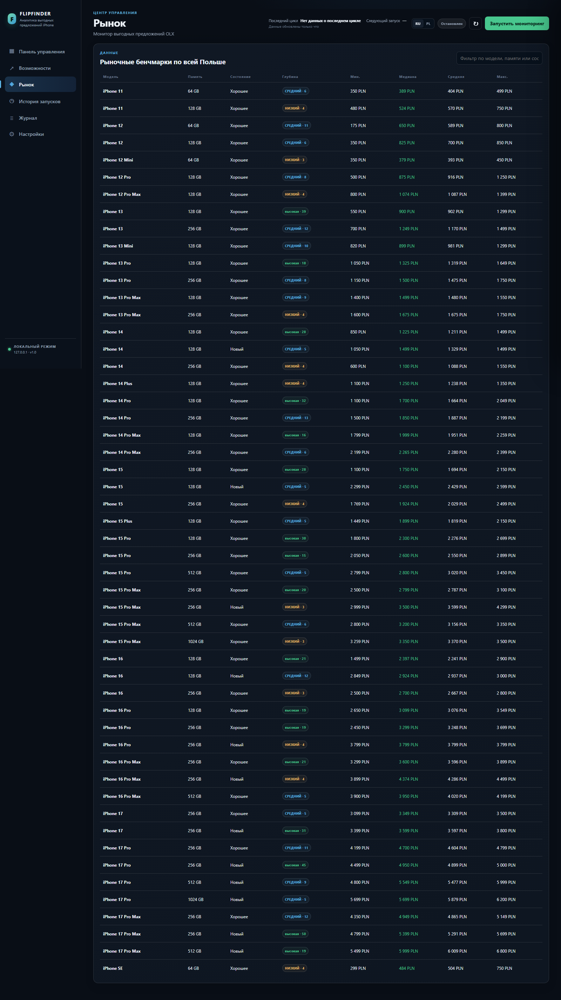
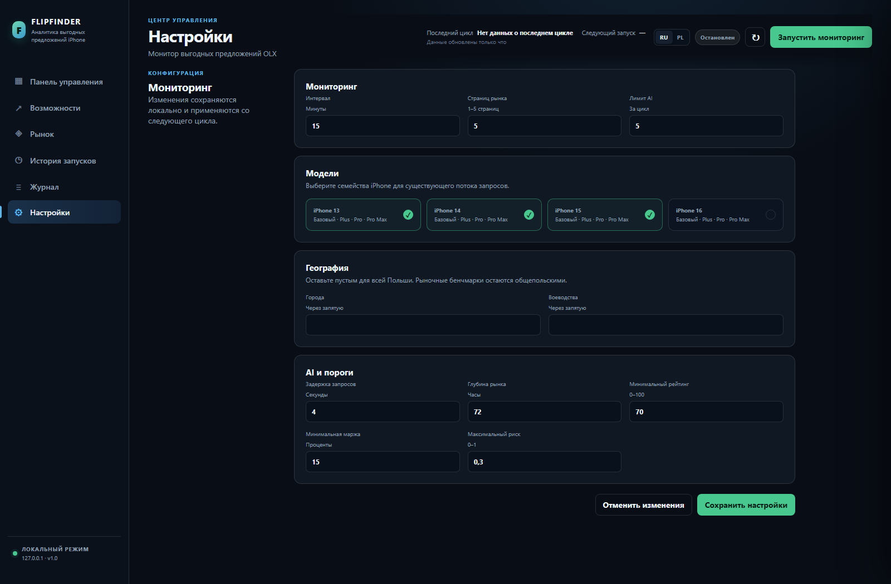

# FlipFinder

**English** | [Русский](README.ru.md) | [Polski](README.pl.md)

## Marketplace Opportunity Intelligence


[](https://github.com/Voll13/flipfinder/actions/workflows/tests.yml)

[](https://github.com/Voll13/flipfinder/stargazers)

Open-source marketplace opportunity intelligence platform.

**Current v1: iPhone deals on OLX Poland.** FlipFinder finds potentially undervalued listings using persistent market benchmarks, AI-assisted risk analysis, deterministic resale estimation, and profitability scoring.

**Vision:** configurable product profiles across multiple marketplaces. This is future direction, not a v1 capability.



## What it does

- Monitors OLX Poland through ordinary local browser automation.
- Maintains a 72-hour market universe with model, storage, and condition benchmarks.
- Ranks market-eligible listings before AI analysis.
- Uses Groq-compatible AI for semantic device and risk signals.
- Calculates deterministic resale and profitability scores.
- Sends localized RU/PL Telegram reports for genuine flip candidates.
- Provides a local RU/PL Web Control Center with review, favorites, comparison, market history, trends, and price-drop handling.

## How it works



## Quick start on Windows

1. Install Python 3.11+ and Google Chrome.
2. Clone the repository and enter it:

   ```powershell
   git clone https://github.com/Voll13/flipfinder.git
   cd flipfinder
   ```

3. Create and activate a virtual environment:

   ```powershell
   python -m venv .venv
   .\.venv\Scripts\Activate.ps1
   pip install -r requirements.txt
   ```

4. Create local configuration:

   ```powershell
   Copy-Item .env.example .env
   ```

5. In `.env`, set a Groq/OpenAI-compatible API key. To receive real alerts, also configure your Telegram bot token and chat ID. Never commit this file.
6. Start the recommended local Web Admin:

   ```powershell
   python -m app.admin
   ```

7. Open [http://127.0.0.1:8000](http://127.0.0.1:8000), configure monitoring, then start it from the panel.

## Supported running modes

Web Admin is recommended for normal use. The CLI monitor is available for controlled local operation:

```powershell
python -m app.main --monitor --interval 15 --market-pages 5 --query "iPhone 13" --query "iPhone 14" --query "iPhone 15" --query "iPhone 16" --limit 5
```

Use `python -m app.main --version` to show the release version.

## Screenshots

| Dashboard | Market | Settings |
| --- | --- | --- |
|  |  |  |

The repository includes only reviewed UI screenshots. It does not include production databases, logs, browser profiles, or credentials.

## Responsible use

FlipFinder does not guarantee that a listing is safe or profitable. AI and risk output are advisory only. Independently verify the seller, device ownership, IMEI, iCloud and Face ID status, payment method, physical condition, and current marketplace rules before acting.

## Support & Custom Setup

FlipFinder is free and open source.

Star and share the repository, report bugs, and contribute improvements to support the Community edition.

If you need help with installation, configuration, or adapting FlipFinder to your workflow, custom assistance is available.

Possible services:

- Installation and configuration
- Telegram / Groq setup
- Custom search profiles
- Product-specific monitoring rules
- Marketplace integrations
- Private customization and automation
- Business-specific adaptations

[](https://t.me/t00116)
[](https://t.me/ProjectMafia)

Commercial assistance is optional. The open-source FlipFinder Community edition remains free.

## License

FlipFinder is licensed under the GNU Affero General Public License v3.0 (AGPL-3.0-only).

See [LICENSE](LICENSE) for details.

## Marketplace compliance

FlipFinder uses ordinary browser automation only. It does not implement CAPTCHA solving, stealth or fingerprint evasion, proxy bypass, cookie theft, or challenge retry loops. If a marketplace blocks or challenges access, stop and handle it safely.

## Limitations

- v1 supports OLX Poland and an iPhone-focused profile.
- The local machine must remain running while monitoring.
- An AI provider is required for semantic analysis and localized AI free-text.
- Marketplace HTML and embedded state can change.

## Contributing and security

See [CONTRIBUTING.md](CONTRIBUTING.md), [SECURITY.md](SECURITY.md), [ROADMAP.md](ROADMAP.md), and [the v1.0.0 release notes](docs/release-v1.0.0.md).
